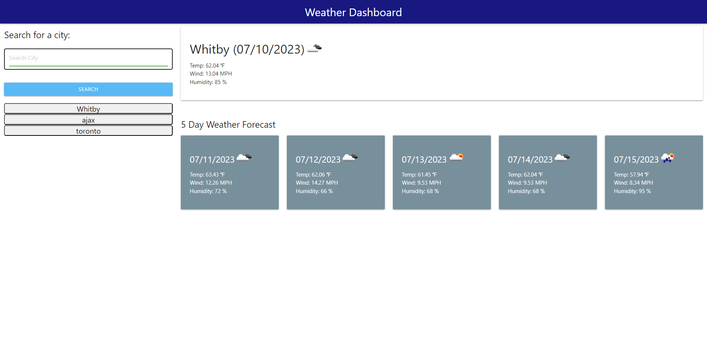

# manjinis-weather-dashboard

## Description
This project is to to build a weather dashboard that will run in the browser and feature dynamically updated HTML and CSS.

## Installation
NA

## Usage

Screenshots from Live site

Application URL: https://manjiniabraham.github.io/manjinis-weather-dashboard/

## Credits

https://developer.mozilla.org/en-US/docs/Web

https://www.w3schools.com/

https://materializecss.com/pickers.html

https://openweathermap.org/api/one-call-3 

https://www.tutorialspoint.com/jquery/index.htm

https://stackoverflow.com/

## Features

* The Weather Dashboard has the following features:
	* When a user searches for a city, user is presented with current and future weather conditions for that city and that city is added to the search history
	* The user is presented with the city name, the date, an icon representation of weather conditions, the temperature, the humidity, and the wind speed for the current day weather.
    * The user is presented with the city name, the date, an icon representation of weather conditions, the temperature, the humidity, and the wind speed for the 5 day forecast weather.
	* When the user clicks on a city in the search history, user is again presented with current and future conditions for that city.
